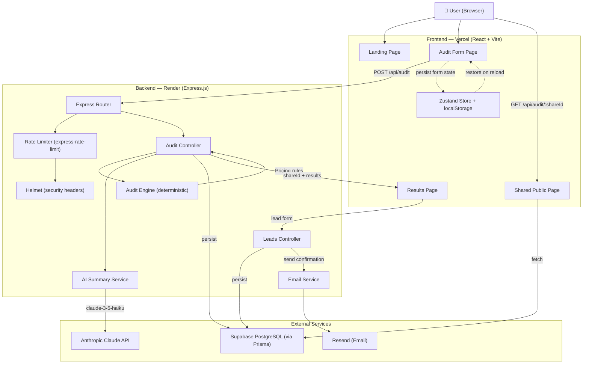

# Architecture — AI Spend Audit

## System Diagram



---

## Frontend / Backend / Database Flow

### Audit Creation Flow
```
1. User fills form (localStorage persists state)
2. POST /api/audit { tools, teamSize, primaryUseCase }
3. Express validates request
4. auditEngine.runAudit() → deterministic recommendations
5. generateAiSummary() → Anthropic call (or fallback template)
6. prisma.audit.create() → Supabase PostgreSQL
7. Return { shareId, recommendations, savings, aiSummary }
8. Frontend redirects to /results/:shareId
```

### Lead Capture Flow
```
1. User submits lead form on Results page
2. POST /api/leads { email, company, role, teamSize, auditId }
3. Honeypot field check (bot protection)
4. Duplicate check by email+auditId
5. prisma.lead.create() → Supabase
6. sendAuditConfirmation() → Resend email (async, non-blocking)
7. Return success immediately
```

### Share URL Flow
```
1. Audit created → shareId generated via nanoid(10)
2. Share URL: https://aispendaudit.com/audit/:shareId
3. GET /api/audit/:shareId → Supabase lookup
4. Returns ONLY: tools, savings, recommendations, aiSummary
5. Never returns: email, company, leadId
6. OG tags injected per-page by react-helmet-async
```

---

## Audit Engine Explanation

The audit engine (`server/src/services/auditEngine.js`) is entirely deterministic — no ML, no AI, no probabilistic output.

**Pricing constants** are hardcoded from official vendor pages (see PRICING_DATA.md). Each tool/plan has a verified price per seat per month.

**Rules are explicit `if/else` checks:**

| Rule | Logic |
|------|-------|
| Overspend detection | `actualSpend > officialPrice × seats × 1.1` |
| Cursor Business → Pro | `plan === 'business' && seats <= 3` |
| Copilot Enterprise → Business | `plan === 'enterprise' && seats < 10` |
| Claude Team → Pro | `plan === 'team' && seats < 3` |
| Claude Max → Pro | `plan === 'max' && seats <= 2` |
| Multiple coding tools | `codingTools.length > 1 && primaryUseCase === 'coding'` |
| ChatGPT + Claude overlap | `hasChatGPT && hasClaude && primaryUseCase === 'writing'` |

**Output:**
- Array of recommendations sorted by savings descending
- Each recommendation includes: type, severity, currentSpend, recommendedAction, estimatedMonthlySavings, estimatedAnnualSavings, explanation
- `totalMonthlySavings` = sum of all recommendation savings
- `totalAnnualSavings` = totalMonthlySavings × 12

---

## AI Summary Architecture

```
Input: { tools, recommendations, totalMonthlySavings, totalAnnualSavings, teamSize, primaryUseCase }
         ↓
buildPrompt() — structures data with exact numbers and strict word count instructions
         ↓
Anthropic claude-3-5-haiku-20241022 — fastest, cheapest, sufficient for 100-word prose
         ↓
     Success?
    ↙       ↘
  Yes         No (network error, rate limit, key missing)
   ↓               ↓
AI summary     generateFallbackSummary() — deterministic template
```

**Hallucination prevention:**
- Prompt explicitly instructs "use EXACT numbers provided below"
- All numbers are injected as string literals — model cannot change them
- Word count constraint (80-110) prevents rambling that introduces errors
- Model is told to NOT invent tools or recommendations not listed

---

## Share URL Architecture

```
nanoid(10) → 10 characters from [A-Za-z0-9_-]
Collision probability at 1M audits: 0.000001% (negligible)
URL format: /audit/xK9mPqR2wE
Public page: strips email, company, leadId from response
```

Chose nanoid over UUID because:
- Shorter URL (10 chars vs 36)
- URL-safe by default
- More entropy per character (64 alphabet vs 16)

---

## Scaling to 10,000 Audits/Day

At 10k audits/day:
- **API layer**: Express is single-threaded but non-blocking. At ~200ms/request (including Anthropic), one Render instance handles ~5 req/s = 432k req/day. More than sufficient.
- **Database**: Supabase's connection pooler (pgBouncer via Prisma's `?pgbouncer=true`) handles concurrent connections. PG handles millions of rows trivially.
- **Anthropic API**: Rate limits are per-account. At 10k/day, we hit ~7 req/min. Anthropic's default limit is 1000 req/min — no issue.
- **Rate limiting**: Move from in-memory to Redis (Upstash) at scale — prevents limits from resetting on server restarts.
- **Cold storage**: Audits older than 90 days can be archived to reduce query times — low priority until 1M+ records.

**Bottleneck at scale**: Anthropic API latency (500ms-2s). Mitigate with:
1. Fire-and-forget: return audit result immediately, update AI summary async
2. Cache common summary patterns (same tool combos → same summary)

---

## Why This Stack?

| Decision | Why |
|---|---|
| **Vite** | Fastest HMR, modern ESM-first, excellent DX |
| **React** | Largest ecosystem, team familiarity, excellent for SPA |
| **TailwindCSS** | Design velocity; utility-first avoids CSS naming wars |
| **Framer Motion** | Production-quality animations with minimal code |
| **Zustand** | 1/10th the boilerplate of Redux, perfect for this scale |
| **Express** | Lightweight, unopinionated, well-understood |
| **Prisma** | Type-safe queries, excellent migration tooling, Supabase-compatible |
| **Supabase** | Managed PostgreSQL with built-in connection pooler, generous free tier |
| **Anthropic Claude** | Best instruction-following for structured prose generation |
| **Resend** | Modern Postmark alternative, excellent deliverability, React Email support |
| **nanoid** | URL-safe, compact unique IDs |
| **Vercel + Render** | Zero-config deployment, free tiers cover MVP scale |
